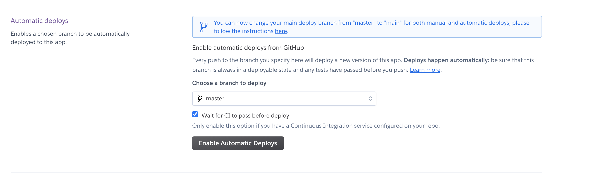

# Heroku Spring Demo

Spring Boot Demo Deployed on Heroku

## Tech Stack
* Spring Boot
* Spring Data JPA
* API Test use Rest-Assured
* Deploy on Heroku
* CI use Travis

## Deploy Roadmap
* Create a GitHub repository;
* Setup Spring boot application;
* Login [Travis CI](https://travis-ci.com/) with your github account and link it with your repository;
    * approval and install travis ci for all your repositories.
      
    * active github app integration
      
    
* Create [Heroku](https://www.heroku.com/) with your github account and link it with the repository;
    * connect heroku to your github account.
    
    * enable auto deploy
    
* Start the heroku console from the terminal;
    * [Heroku CLI Deployment](https://github.com/qicaisheng/heroku-spring-demo/blob/master/document/heroku-cli-deployment.md)
    * [Deploy to Heroku via Github](https://github.com/qicaisheng/heroku-spring-demo/blob/master/document/github-auto-deployment-to-heroku.md)
* Create Postgres database ( Don't use mysql )
    * [Install Heroku Postgres Add-Ons](https://github.com/qicaisheng/heroku-spring-demo/blob/master/document/install-heroku-postgres-add-ons.md)
* Setup a [travis yml file](https://docs.travis-ci.com/user/deployment/heroku/);
* Push it.
    

## Config Travis CI
* [Travis CI Get Started](https://travis-ci.com/getting_started)
